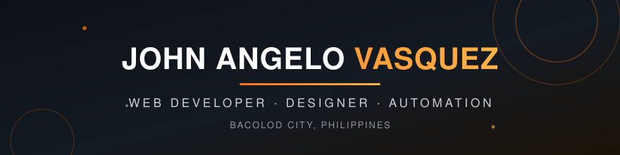

  

  

  
  
  
   
  

---

## About Me

Fresh graduate (**BS Information Systems** — Bacolod City College) who builds practical web systems: a QR-based attendance platform used in a real port office, a construction project management system, and CRM automation funnels. I care about clean design, accurate data, and shipping things that actually get used.

- Currently building with **Next.js, React, Prisma & PHP**
- I automate with **GoHighLevel** — pipelines, workflows, booking & email sequences
- I design **ad creatives** and produce **AI-generated video ads**
- Open to remote roles: web development, data entry, CRM automation, design
- Contact: **vasquezjohnangelod.9@gmail.com**

<b>Experience highlights</b> (click to expand)

 

- **Philippine Ports Authority (OJT Lead Developer)** — Led the QR Attendance Monitoring System: QR generation/scanning, real-time logs, admin dashboard, deployed and presented to PPA officials.
- **National Labor Relations Commission (OJT)** — Encoded labor-case data into Excel, maintained digital/physical records with strict accuracy.
- **Ownly Corp — Junior Data Analyst** — Back-office data encoding, audits, and updates in a remote team.
- **Velstand Furniture — Graphic Design & Customer Support** — Social media ad creatives and customer inquiry handling.

<b>What I can do for you</b> (click to expand)

 

| Service | Details |
|---|---|
| Web Development | Business sites, dashboards, and internal systems (Next.js, React, PHP) |
| Data Entry & Admin Support | Accurate, fast encoding — Excel, Google Sheets, CRM data cleanup |
| GoHighLevel Automation | Pipelines, booking workflows, email sequences, funnel setup |
| Graphic Design | Social media posts, ad creatives, marketing visuals |
| AI Video Ads | Short-form product ads and promotional videos |

<b>Currently</b> (click to expand)

 

- Learning advanced Next.js patterns and marketing automation
- Building AI video production workflows
- Open to **remote full-time or part-time** work, available to start immediately

---

## Tech Stack

  

**Also in my toolbox:** Prisma ORM · Microsoft Excel · GoHighLevel · Canva · WordPress · SQL

---

## Featured Projects

| Project | Description | Stack |
|---|---|---|
| [Construction Project Management System](https://github.com/gegelo070903/capstone4a) | Capstone platform for managing construction projects, tasks, and progress tracking | PHP · MySQL |
| [QR Attendance Monitoring System](https://github.com/gegelo070903/Attendance-Monitoring-for-PPA) | QR-code attendance system built for the Philippine Ports Authority — scanning, real-time logs, reports | Next.js · React · Prisma |
| [Portfolio Website](https://github.com/gegelo070903/portfolio) | My personal portfolio — dark, minimal, orange-accented ([live site](https://gegelo070903.github.io/portfolio/)) | HTML · CSS · JS |
| LET Mastery Funnel | Early-access funnel with a 3-stage GoHighLevel pipeline: intake, booking, appointment — fully automated emails | GoHighLevel |

---

## GitHub Stats

  
  

<b>Contribution snake</b> (click to expand)

 

  

<i>An animated snake that eats my contribution graph — regenerated daily by GitHub Actions.</i>

---

  <i>"Clean design, accurate data, and work that actually gets used."</i> 
  <b>Open to remote opportunities worldwide</b>

